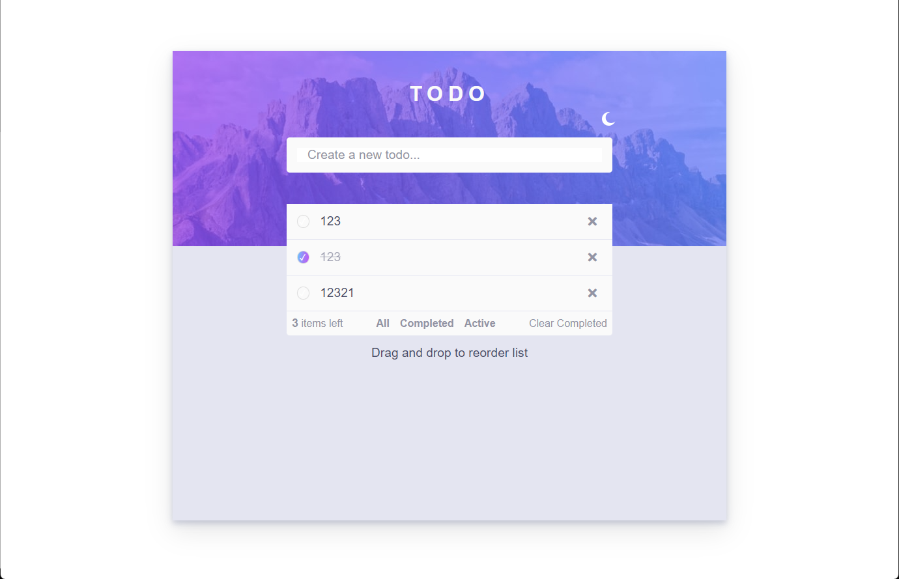

# FrontEnd Mentor Challange

This is a solution to the [Todo app challenge on Frontend Mentor](https://www.frontendmentor.io/challenges/todo-app-Su1_KokOW).

### Screenshot

### Built with

- Semantic HTML5 markup
- CSS3
- Flexbox
- JS
- Localstorage

### Links

- [Live Site URL](https://frontend-todo-app.netlify.app/)

### Things implemented

- Responsive design
- Slideshow
- Animations
- Color mode toggler
- Todos are being saved in local storage

### Things user able to do

- Toggle color mode
- Create new todo
- Delete new todo
- Delete all the completed todos
- Complete todo
- Filter all/completed/active todos

